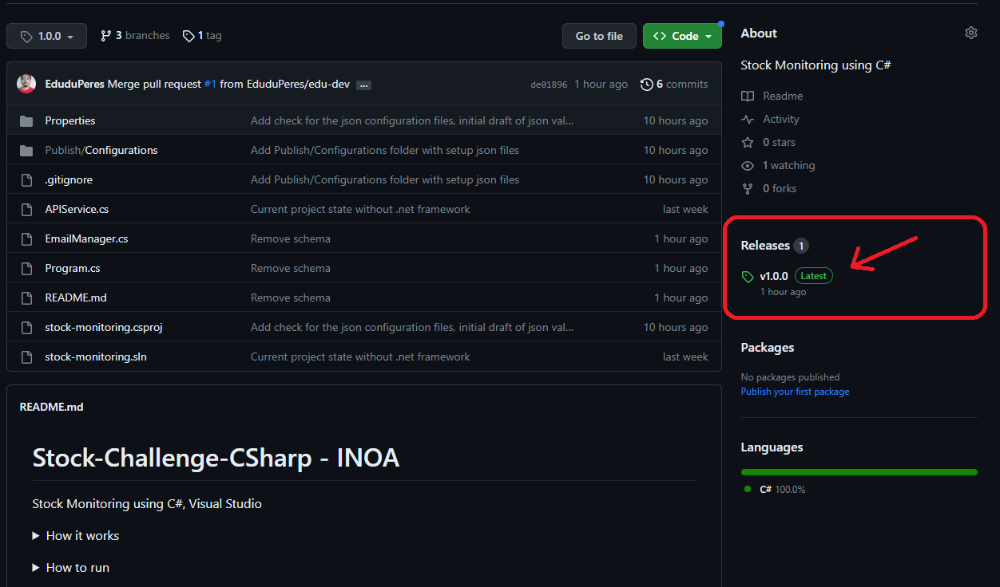
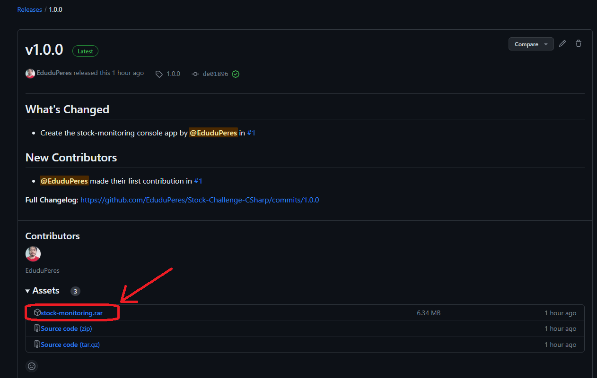
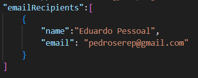
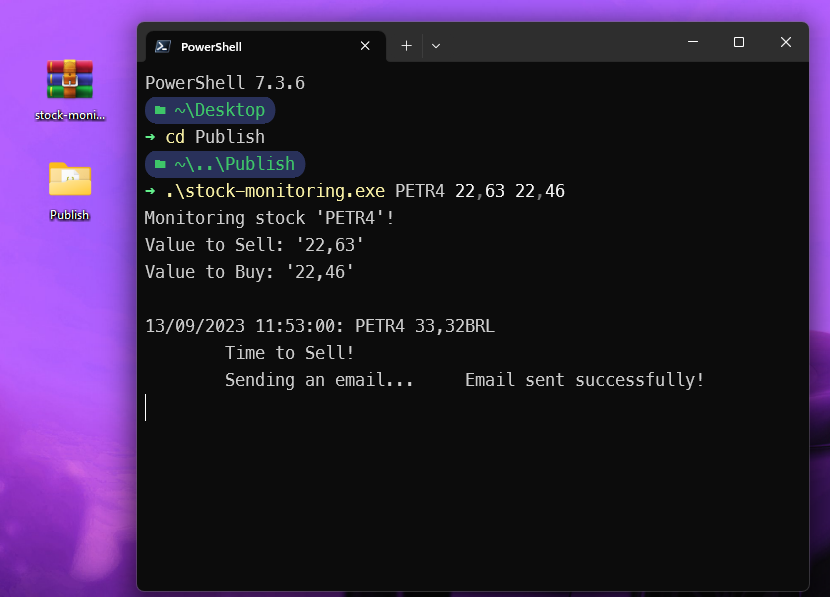

# Stock-Challenge-CSharp - INOA
Stock Monitoring using C#, Visual Studio

<details>
<summary>How to run</summary>

Go to `Releases` and choose a release, in the case above `v1.0.0`


Click on `stock-monitoring.rar` to download it


Extract the Folder `Publish` from `stock-monitoring.rar`.<br>
Open `Publish/Configurations/email-configuration.json` and change the `emailRecipients` property to the email you want to receive the sell/buy alerts<br>


Then, enter the Folder `Publish` on Terminal<br>
run `.\stock-monitoring.exe <stock> <value to sell> <value to buy>`<br>
Obs: In `<value to sell>` and `<value to buy>` use comma, not dot, to separate integer and decimal<br>
Ex: `.\stock-monitoring.exe PETR4 23,63 22,48`


Obs:
- The program monitores the selected stock, minute by minute.
- The start minute can have delay between 20 - 45 minutes. That means that if you start the program at 13:30h, the initial monitored time can be between 12:45h and 13:10h
- Ex: Started the program at 13:30h. The initial time the stock was consulted was 13:00h. Then the next minute it will show the stock value on 13:01h, then 13:02h, and so on.
</details>

<details>
<summary>How it works</summary>

The exe file needs 3 arguments: `stock name`, `value to sell`, `value to buy`<br>
The program uses two json files (that should be on `Publish/Configurations`) with data used for configure the email sender:
```
email-configuration.json:{
    {
        "serverSMTP": string,
        "serverPORT": number,
        "senderName": string,
        "senderEmail": string,
        "senderAppPassword": string,
        "emailRecipients":[
            {
                "name": string,
                "email": string
            },
            {
                "name": string,
                "email": string
            },
            ...
        ]
    }
}
```
```
email-templates.json:{
    "sellAlert":{
        "title": string,
        "body":  string
    },
    "buyAlert":{
        "title": string,
        "body":  string
    }
}
```
Obs:
- In `email-templates.json > sellAlert, buyAlert`<br>
- The title and body must be strings with parameters. 
- Title must have '{0}' as the stock name. 
- Body must have '{0}' as the stock name, '{1}' as the stock's current value, '{2}' as the template's limit value ('value to sell' on 'sellAlert' and 'value to buy' in 'buyAlert')
- Body can be written in HTML 
</details>
